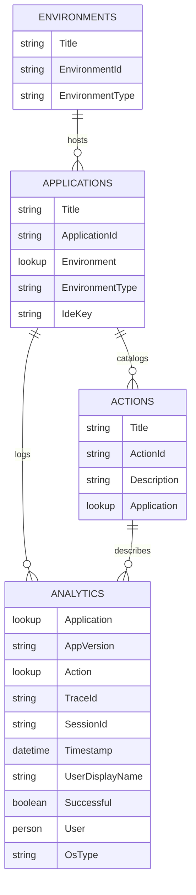
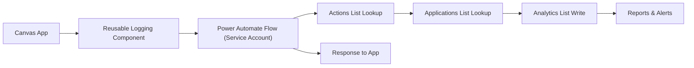

## Why Custom Logging Matters

Canvas apps often bridge multiple business processes and run in several environments. Without consistent telemetry you cannot correlate failures to deployments, compare adoption between Dev/Test/Prod, or respond quickly to regression reports. A dedicated logging pipeline also keeps the SharePoint site secure because log writes happen via a service account instead of every end user needing contribute rights.

## SharePoint Data Model

Four SharePoint lists power the solution: `environments`, `applications`, `actions`, and the append-only `analytics` log. The first three act as codelists so the analytics entries stay normalized even as apps move between environments.


```

### Intent of Each List

- **Environments** keep a canonical list of tenants or ALM stages so reporting can pivot on `EnvironmentType` without parsing text.
- **Applications** store each canvas app’s ID, friendly name, Jira/ADO link, and environment lookup so you can filter logs per app or per lane.
- **Actions** define every telemetry event up front. Product and support teams share this taxonomy, which improves discoverability in reports.
- **Analytics** is the only mutable table. Every record is an immutable fact about one user interaction.

## Flow-Orchestrated Logging

A single Power Automate flow writes every log entry. The canvas app calls it by passing just the actionable context while the flow enriches the request with SharePoint lookups.



### Flow Inputs from the App

| Parameter   | Example            | Purpose |
|-------------|--------------------|---------|
| `action_id` | `SUBMIT_FORM`      | Maps to `actions` row; drives lookups and reporting taxonomy. |
| `app_version` | `1.12.0`         | Correlates issues to deployment packages. |
| `successful` | `true`/`false`    | Allows quick failure-rate calculations without parsing messages. |
| `session_id` | `fe5c...`         | Links multiple actions in one visit, handy for tracing. |
| `os_type` | `Windows`, `iOS`     | Highlights device-specific issues. |

Inside the flow:

1. **Trigger**: `Power Apps (V2)` stores the five parameters and captures `utcNow()` for the timestamp.
2. **Lookup action** using `action_id`, expand the application lookup, and pull `application_id`, environment info, and Jira IDE reference.
3. **Generate identifiers**: the flow creates a `trace_id` GUID. Optionally enrich it with session info for multi-step operations.
4. **Keep the SharePoint site locked down**: the connection uses a service account, so regular users do not need write permissions.
5. **Write to `analytics`** with the resolved lookups plus user context from the trigger headers (`user_displayname`, `user`).
6. **Respond to the app** with a Boolean/JSON payload so the app can retry or show toasts.

## Instrumenting the Canvas App

- Create a `cmpLogger` component that wraps the `Power Automate` connector call. Expose properties for every flow parameter plus helper methods like `LogSuccess` and `LogFailure`.
- On `App.OnStart`, set `Set(varSessionId, GUID())`, detect the OS via `Device().OSType`, and store the current app version in a global variable.
- Wrap critical logic in `IfError` to make sure the user action completes even when the logging flow is down; surface a subtle notification if logging fails.
- Trigger logging at meaningful checkpoints: submitting forms, launching integrations, saving drafts, or handling unexpected errors.

## Making the Analytics Actionable

- **Dashboards**: Connect the `analytics` list to Power BI to build slicers for action, application, environment, and `successful`. Add DAX measures like `Failure Rate = 1 - AVERAGE(Analytics[Successful])`.
- **Alerts**: Create Power BI or Power Automate alerts when failures exceed a threshold within a rolling window so engineers get notified automatically.
- **Metadata hygiene**: Treat the `actions` list as source-controlled metadata. Require pull requests or approvals before adding new action IDs so your reports stay clean.
- **Lifecycle**: Include the `ide` (Jira) key on the `applications` list so every log row can be traced back to its backlog item during RCA meetings.

## Next Steps

1. Clone this structure into your existing SharePoint logging hub or adapt the columns to your governance standards.
2. Add screenshots of the SharePoint lists and flow steps before publishing to help readers visualize the setup.
3. Embed the `cmpLogger` component into one pilot app, validate the full round-trip, and then roll it across the portfolio.

By standardizing the data model and offloading list writes to a service-account Power Automate flow, you gain trustworthy telemetry without sacrificing security. Over time, these logs evolve from simple audit trails into actionable insights that guide support, product roadmaps, and compliance.
