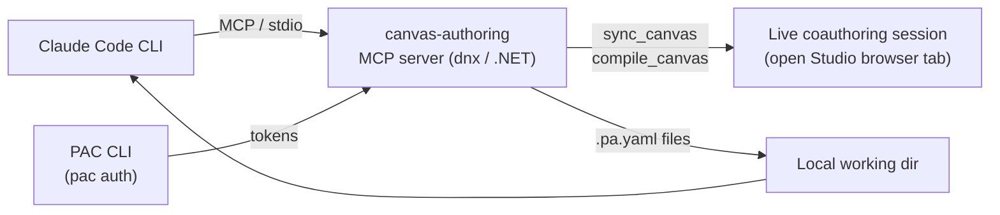

Canvas apps have always been a little awkward to *review*. The logic lives in Power Fx scattered across control properties, the structure hides behind a drag-and-drop tree, and the source format was, for years, an opaque `.msapp` zip. You could eyeball a screen in Studio, but you couldn't sit down and read the app the way you read a pull request.

That changed for me the day I pointed **Claude Code** at a live coauthoring session through the **Canvas Authoring MCP server**. Suddenly the entire app was a folder of `.pa.yaml` files I could read, diff, critique, and edit — with an AI that already knows every control's property schema and can validate its own changes before they hit the live app.

This post covers three things: a condensed setup so you can reproduce it, the actual code-review session, and, importantly, an honest account of what coauthoring mode **cannot** do, including a wall I hit with components.

**TL;DR:** With coauthoring turned on, the Canvas Authoring MCP server turns a Power Apps canvas app into `.pa.yaml` files Claude Code can read, review against the real control and data-source schema, and validate with `compile_canvas` before changes go live. It is excellent for *reviewing* apps, still preview-grade for *editing* them, and components broke the sync round-trip in my testing.
{: .notice--info}

## How the pieces fit together

The mental model is worth getting right before you touch any config. Claude Code talks to a **live browser tab** running your app in Power Apps Studio. The PAC CLI supplies the auth tokens. The MCP server is the bridge.



*Figure: Claude Code talks to the canvas-authoring MCP server over stdio. The MCP server uses PAC CLI auth tokens to reach the live coauthoring session and writes `.pa.yaml` files into your local working directory, which Claude Code then reads.*

Two things follow from this diagram that trip everyone up:

1. **The browser tab is the transport.** Close the Studio tab and the coauthoring session ends — `sync_canvas` and `compile_canvas` stop working until you reopen it.
2. **There is no separate "push" tool.** The MCP exposes `sync_canvas` (pull) and `compile_canvas` (validate); the write path back into the app is the coauthoring session itself. You don't upload an `.msapp` — your validated YAML flows back through the live session.

## Setting it up

This is the condensed version, enough to get you reviewing. If you want the complete, step-by-step walk-through — IDs, scopes, PAC auth, and a troubleshooting table — see the [full setup tutorial]().

### Prerequisites

| Tool | Why | Install |
| --- | --- | --- |
| .NET 10 SDK | The MCP server runs on it | [dotnet.microsoft.com/download/dotnet/10.0](https://dotnet.microsoft.com/download/dotnet/10.0) |
| Node.js 18+ | Plugin installer | [nodejs.org](https://nodejs.org) |
| Claude Code CLI | The agent | `npm install -g @anthropic-ai/claude-code` |
| PAC CLI | Auth tokens for the MCP | `dotnet tool install --global Microsoft.PowerApps.CLI.Tool` |

### 1. Install the Canvas Apps plugin

Inside a Claude Code session:

```
/plugin marketplace add microsoft/power-platform-skills
/plugin install canvas-apps@power-platform-skills
```

This gives you `/configure-canvas-mcp`, `/generate-canvas-app`, and `/edit-canvas-app`.

### 2. Turn on coauthoring in the app

In Power Apps Studio: **Settings → Updates → Coauthoring** toggle. Save, and **leave the tab open** for the whole session.

### 3. Register the MCP server

The easy path is to run `/configure-canvas-mcp` and paste your Studio URL — it extracts the environment ID and app ID for you. The manual equivalent:

```bash
claude mcp add --scope project canvas-authoring \
  -e CANVAS_ENVIRONMENT_ID=<ENV_ID> \
  -e CANVAS_APP_ID=<APP_ID> \
  -e CANVAS_CLUSTER_CATEGORY=prod \
  -- dnx Microsoft.PowerApps.CanvasAuthoring.McpServer --yes --prerelease --source https://api.nuget.org/v3/index.json
```

Both IDs come straight out of the Studio URL (`/e/<ENV_ID>/...&app-id=...%2Fapps%2F<APP_ID>...`). `CLUSTER_CATEGORY` is `prod` for `make.powerapps.com`. Restart Claude Code afterwards.

### 4. Authenticate PAC

```bash
pac auth create --environment <ENV_ID>
pac auth list   # confirm one profile is Active
```

This is the step that silently bites you: without an active PAC profile, `sync_canvas` returns *"No files returned from server"* even when coauthoring is on. The MCP server and PAC auth are independent processes — you do **not** need to restart Claude Code after authenticating; the token is picked up dynamically.

A quick sanity check that the MCP is live — ask Claude:

> List available Canvas App controls

If it calls `list_controls` and returns real Fluent controls, you're connected.

## The code-review session

Here's where it gets fun. With everything wired up, I asked Claude Code to sync the app down and review it:

> Sync the canvas app to `./review` and review it for bugs, performance, and maintainability.

Under the hood `sync_canvas` writes one `.pa.yaml` per screen into the folder, and now the whole app is readable source. A trimmed example of what a control looks like in this format:

```yaml
- 'btnSubmit':
    Control: Classic/Button
    Properties:
      Text: ="Submit"
      OnSelect: |
        =If(
            IsBlank(txtEmail.Text),
            Notify("Email is required", NotificationType.Error),
            SubmitForm(frmRequest)
        )
      Fill: =RGBA(0, 120, 212, 1)
```

Because the app is now plain text, the review is a *real* review. The things Claude flagged that I'd genuinely want a reviewer to catch:

- **Delegation risks** — `Filter()` / `LookUp()` against a data source using non-delegable functions, the classic silent 2,000-row ceiling.
- **Duplicated Power Fx** — the same formula pasted across several controls that should have been a single named variable or a component property.
- **Hardcoded values** — literal colors and magic strings instead of theme variables, and environment-specific URLs baked into `OnSelect`.
- **Naming and consistency** — controls left as `Button1`, `Label3` across screens, which makes every other formula harder to read.
- **Accessibility gaps** — images and icons missing `AccessibleLabel`.

Several of these themes (duplication, hardcoded values, consistency) are the same ones I wrestled with when building a [custom logging pattern for canvas apps](); a review that surfaces them automatically is a real time-saver.

The part that makes this more than a linter: the MCP gives Claude `describe_control`, `list_apis`, `describe_api`, `list_data_sources`, and `get_data_source_schema`. So it isn't guessing at property names or column types — it can check a formula against the **actual** schema of the data source it queries, and against the **real** property surface of the control it lives on. That's context a human reviewer usually has to go dig for tab by tab.

When I asked it to *fix* a couple of the findings, the loop was: edit the local `.pa.yaml`, run `compile_canvas`, read any line-level errors it returned, fix, recompile until clean. The validation happens against the live authoring service, so a green compile means the change is genuinely valid Power Fx — not just plausible-looking text.

## What you *can* do in coauthoring mode

- **Read the whole app as source.** Every screen, every control, every formula, in `.pa.yaml`. This alone is the unlock.
- **Review with real metadata.** Control schemas, connector operations, and data-source column types are all queryable, so the feedback is grounded rather than hallucinated.
- **Edit and validate before it goes live.** `compile_canvas` is a real gate — it catches mistakes against the Power Apps schema, and you iterate until clean.
- **Generate new screens and apps.** `/generate-canvas-app` spins up screens from a description; `/edit-canvas-app` handles modifications, routing complex changes through planner/editor sub-agents.
- **Discover before you build.** `list_controls` means the agent designs with the controls that actually exist in your session, not an outdated mental model.

## What you *can't* do (and the component wall)

Being honest here, because the marketing won't be:

- **It's preview.** The plugin and MCP server are explicitly prerelease. Behavior changes, and you opt into prerelease NuGet packages to even run it.
- **No tab, no session.** There is no offline / headless mode for the coauthoring tools. Close the browser and you're done until you reopen it.
- **No first-class "push."** You don't get an upload-an-`.msapp` step. Changes round-trip through the live session, which is elegant when it works and opaque when it doesn't.
- **Auth is a separate, fragile leg.** The infamous *"No files returned from server"* is almost always PAC auth pointing at the wrong environment, or no active profile at all.

And the one I actually hit:

> **Components broke the round-trip for me.** On an app that used components, `sync_canvas` / `compile_canvas` errored out rather than completing cleanly. I want to be precise about what this is and isn't: it is *my observed behavior in a preview build*, not a documented limitation — I went looking and Microsoft's plugin docs say nothing about a component restriction. So treat it as a "your mileage may vary, test before you rely on it" caveat rather than a hard rule. If your app leans heavily on canvas components or component libraries, validate that the sync/compile cycle survives them *before* you build a review workflow around it.

As a fallback when the live sync won't cooperate at all, you can still pull the source the old-fashioned way:

```bash
pac canvas download --name <APP_ID> --extract-to-directory "C:/canvas-app-docs" --overwrite
```

That gives you the same `.pa.yaml` files to read and review locally — but note that changes made this way are **not** pushed back through coauthoring automatically.

## Is it worth it?

For *reviewing* canvas apps: unreservedly yes, even in preview. Turning an app into readable, schema-aware source and pointing a capable agent at it caught things in minutes that would take a careful human a long afternoon of clicking through Studio. The delegation and duplicated-formula findings alone paid for the setup.

For *editing* production apps through it: I'd stay cautious while it's preview, keep the component caveat in mind, and lean on `compile_canvas` as the safety net it's meant to be. The direction is clearly right: canvas apps are finally something you can [treat like code](), and the tooling to review them like code is catching up fast.

*Setup details in this post are condensed from my [full setup tutorial]() for the Canvas Authoring MCP; if the sync step misbehaves, nine times out of ten it's coauthoring being off or PAC auth pointing at the wrong environment.*
