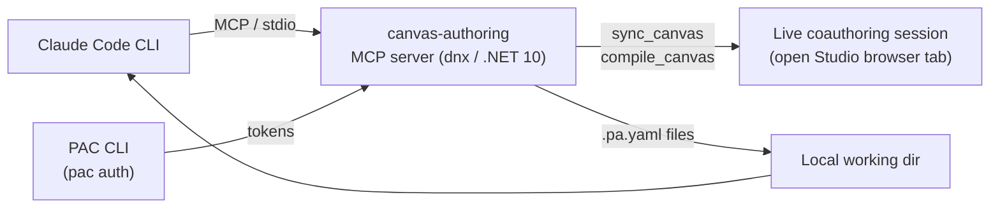

When I [reviewed a canvas app with Claude Code](), I kept the setup to a single condensed section so the story stayed about the review. This post is the part I left out: the complete walk-through, start to finish, including the two or three places everyone gets stuck.

By the end you'll have Claude Code reading your canvas app as plain `.pa.yaml`, grounded in the real control and data-source schema, and validating its own edits against the live authoring service before they touch the app.

**TL;DR:** Install the `canvas-apps` plugin, turn on coauthoring in Power Apps Studio, register the **Canvas Authoring MCP server** with your environment and app IDs, authenticate the **PAC CLI** against the same environment, then run `sync_canvas` to pull the app down as `.pa.yaml` and review it. The single most common failure — *"No files returned from server"* — is almost always PAC auth pointing at the wrong environment, not the MCP itself.
{: .notice--info}

## What you're actually wiring together

Get the mental model right first and most of the setup explains itself. Claude Code never talks to Power Apps directly. It talks to an MCP server, and that server reaches your app through a **live browser tab** running in Power Apps Studio. PAC CLI supplies the auth tokens. Nothing else.



*Figure: Claude Code talks to the canvas-authoring MCP server over stdio. The server uses PAC tokens to reach the live coauthoring session and writes `.pa.yaml` files into your working directory.*

Two consequences fall straight out of that diagram, and both bite newcomers:

1. **The browser tab is the transport.** Close the Studio tab and the coauthoring session ends. `sync_canvas` and `compile_canvas` stop working until you reopen it.
2. **There's no "push" button.** The MCP exposes `sync_canvas` (pull) and `compile_canvas` (validate). The write path back into the app *is* the coauthoring session. You don't upload an `.msapp` — validated YAML round-trips through the live tab.

Keep those in mind and the rest is mechanical.

## Step 0: Prerequisites

Install these before you touch anything else. The MCP server runs on .NET 10, so that one is non-negotiable — the setup skill literally refuses to continue without it.

| Tool | Why you need it | Install |
| --- | --- | --- |
| .NET 10 SDK | Runs the MCP server (via `dnx`) | [dotnet.microsoft.com/download/dotnet/10.0](https://dotnet.microsoft.com/download/dotnet/10.0) |
| Node.js 18+ | Runs the Claude Code plugin tooling | [nodejs.org](https://nodejs.org) |
| Claude Code CLI | The agent itself | `npm install -g @anthropic-ai/claude-code` |
| PAC CLI | Auth tokens for the MCP | `dotnet tool install --global Microsoft.PowerApps.CLI.Tool` |
| A canvas app | The thing you're reviewing | Any app you can open in Power Apps Studio |

Confirm the two that matter most:

```bash
dotnet --list-sdks   # need a 10.x.y line
pac --version
```

If `dotnet --list-sdks` shows nothing in the 10 range, stop and install it. Everything downstream depends on it.

## Step 1: Install the Canvas Apps plugin

Inside a Claude Code session, add the Microsoft marketplace and install the plugin:

```
/plugin marketplace add microsoft/power-platform-skills
/plugin install canvas-apps@power-platform-skills
```

That gives you three slash commands — `/configure-canvas-mcp`, `/generate-canvas-app`, and `/edit-canvas-app` — plus the skills that drive them. For reviewing, `/configure-canvas-mcp` is the one you care about right now.

## Step 2: Turn on coauthoring in the app

In Power Apps Studio, open your app and go to **Settings → Updates → Coauthoring** and switch it on. Save.

Then **leave the tab open for the entire session.** I'm repeating this because it's the rule people break without noticing: the coauthoring session lives in that tab, and the MCP server has nothing to talk to once it's closed.

## Step 3: Read your IDs out of the Studio URL

The MCP server needs two values — your environment ID and your app ID — and both are sitting in the Studio browser URL. With the app open in Studio, copy the address bar. It looks like this:

```
https://make.powerapps.com/e/Default-91bee3d9-0c15-4f17-8624-c92bb8b36ead/canvas/?action=edit&app-id=%2Fproviders%2FMicrosoft.PowerApps%2Fapps%2F6fc3e3d1-292b-4281-8826-577f78512e56
```

Three things come out of that URL:

- **Environment ID** — the segment between `/e/` and the next `/`. Here: `Default-91bee3d9-0c15-4f17-8624-c92bb8b36ead`.
- **App ID** — URL-decode the `app-id` parameter, then take the last segment after the final `/`. Here: `6fc3e3d1-292b-4281-8826-577f78512e56`.
- **Cluster category** — derived from the hostname (table below).

The hostname tells the MCP which cloud you're on:

| Studio hostname | Cluster category |
| --- | --- |
| `make.powerapps.com` | `prod` |
| `make.preview.powerapps.com` | `prod` |
| `make.gov.powerapps.us` | `gov` |
| `make.high.powerapps.us` | `high` |
| `make.apps.appsplatform.us` | `dod` |
| `make.powerapps.cn` | `china` |
| anything else | `test` |

For the public commercial cloud (`make.powerapps.com`), it's `prod`. If you don't want to parse the URL by hand, you don't have to — `/configure-canvas-mcp` does exactly this extraction for you when you paste the URL in the next step.

## Step 4: Register the MCP server

You've got two paths. Pick one.

### The easy path

Run the slash command and let it do the parsing:

```
/configure-canvas-mcp
```

It asks for your Studio URL, pulls out the environment ID, app ID, and cluster category, and asks where to register the server. The scope options for Claude Code are:

- **User** — available in every project for your account.
- **Project** — shared with the repo (written to `.mcp.json`), the default.
- **Local** — just this project directory.

Pick **Project** if you want the config committed alongside the app's YAML, **User** if you review apps from lots of folders.

### The manual path

If you'd rather see exactly what's registered, run the equivalent yourself:

```bash
claude mcp add --scope project canvas-authoring \
  -e CANVAS_ENVIRONMENT_ID=<ENV_ID> \
  -e CANVAS_APP_ID=<APP_ID> \
  -e CANVAS_CLUSTER_CATEGORY=prod \
  -- dnx Microsoft.PowerApps.CanvasAuthoring.McpServer --yes --prerelease --source https://api.nuget.org/v3/index.json
```

Swap in the values from Step 3. Note the `--prerelease` flag — the server ships as a prerelease NuGet package, and you opt into it explicitly. If the command complains that `canvas-authoring` already exists, remove it and re-add:

```bash
claude mcp remove canvas-authoring
```

Either way, **restart Claude Code afterward** so it picks up the new server. If you're in a session you don't want to lose, resume it with `claude --continue`.

## Step 5: Authenticate the PAC CLI

This is the step that silently breaks the whole thing if you skip it. The MCP server uses PAC tokens to reach the coauthoring session, so PAC has to hold an **active profile pointed at the same environment** as your app.

```bash
pac auth create --environment <ENV_ID>
pac auth list   # confirm exactly one profile shows as Active
```

Two details worth internalizing:

- Without an active profile, `sync_canvas` returns *"No files returned from server"* even when coauthoring is on. The error blames the server; the cause is auth.
- The MCP server and PAC auth are independent processes. You do **not** need to restart Claude Code after authenticating — the token gets picked up dynamically.

## Step 6: Verify the connection

Before you ask for a review, confirm the wiring with a no-risk probe. In Claude Code, ask:

> List available Canvas App controls

If Claude calls `list_controls` and returns real Fluent controls (Button, Label, Gallery, and friends), you're connected end to end. If it can't, you've got a setup problem to fix before going further — jump to [Troubleshooting](#troubleshooting).

## Step 7: Run your first review

Now the payoff. Point Claude at the app and ask it to pull the source down and read it:

> Sync the canvas app to `./review` and review it for bugs, performance, and maintainability.

Under the hood `sync_canvas` writes one `.pa.yaml` file per screen into `./review`, and the whole app becomes readable text. A control looks like this:

```yaml
- 'btnSubmit':
    Control: Classic/Button
    Properties:
      Text: ="Submit"
      OnSelect: |
        =If(
            IsBlank(txtEmail.Text),
            Notify("Email is required", NotificationType.Error),
            SubmitForm(frmRequest)
        )
      Fill: =RGBA(0, 120, 212, 1)
```

Because it's plain text grounded in real metadata — the MCP gives Claude `describe_control`, `list_apis`, `describe_api`, `list_data_sources`, and `get_data_source_schema` — the feedback is checked against the actual schema rather than guessed. Expect it to flag delegation risks, duplicated Power Fx, hardcoded values and magic strings, sloppy naming, and missing `AccessibleLabel` properties. I covered what a real run surfaced in the [companion review post]().

### The edit-and-validate loop

When you ask Claude to *fix* a finding, the loop is tight:

1. It edits the local `.pa.yaml`.
2. It runs `compile_canvas`, which validates against the live authoring service.
3. It reads any line-level errors, fixes them, and recompiles until clean.

A green compile means the change is genuinely valid Power Fx, not just plausible-looking text. That validation step is the safety net — lean on it, especially while the tooling is still preview.

## Troubleshooting

Nine out of ten problems are one of these:

| Symptom | Likely cause | Fix |
| --- | --- | --- |
| *"No files returned from server"* | No active PAC profile, or it's pointed at the wrong environment | `pac auth list`, then `pac auth create --environment <ENV_ID>` for the right one |
| `canvas-authoring` not in the MCP list | Server registered but Claude not restarted | Restart Claude Code (`claude --continue` to keep context) |
| `list_controls` does nothing | MCP not registered, or `dnx`/.NET 10 missing | Re-run Step 4; confirm `dotnet --list-sdks` shows 10.x |
| `sync_canvas` / `compile_canvas` hang or error mid-session | Studio tab closed, so the coauthoring session died | Reopen the app in Studio with coauthoring on, leave the tab open |
| Sync errors on an app that uses components | Observed preview behavior — components broke the round-trip in my testing | Validate the sync/compile cycle on a component-using app *before* you build a workflow on it; fall back to download (below) |

When the live sync won't cooperate at all, you can still pull the source the old-fashioned way:

```bash
pac canvas download --name <APP_ID> --extract-to-directory "C:/canvas-app-docs" --overwrite
```

That gives you the same `.pa.yaml` files to read and review locally. The catch: changes made this way are **not** pushed back through coauthoring — it's read-only review, not the live loop.

## Where to go from here

You now have the full pipeline standing: source you can read, schema-grounded review, and validated edits. For what an actual review run catches — the delegation traps, the duplicated formulas, and an honest account of where coauthoring mode still falls short — read the [canvas app code-review walkthrough]().

And if you're curious how this fits the broader "treat Power Apps like code" direction, my [Code App Diary]() tracks the same instinct from the other end.

*This setup is current for the preview release of the Canvas Authoring MCP. It's prerelease software — behavior changes, and the component caveat above is observed, not documented. Test before you build a team workflow on it.*
